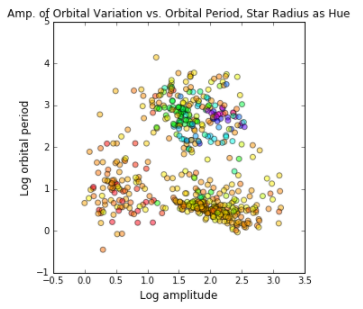

Code documentation can be found <a href="https://github.com/gmiers7642/exoplanets/blob/master/Code_Documentation.md">here.</a>

# Outline
1. [Unsupervised Learning](#1Unsupervised Learning)
2. [Exoplanets](#2Exoplanets)
3. [Data Challenges](#3Data Challenges)
4. [Methodology](#4Methodology)
    * [4.1 Data Downloading and Preparation](#4_1 Data Downloading and Preparation)
    * [4.2 Imputation of Missing Data](#4_2 Imputation of Missing Data)
    * [4.3 Automatic Feature Selection](#4_3 Automatic Feature Selection)
    * [4.4 Creation of Clusters](#4_4 Creation of Clusters)
    * [4.5 Dimensionality Reduction](#4_5 Dimensionality Reduction)
    * [4.6 Visualization](#4_6 Visualization)
    * [4.7 Interpretation](#4_7 Interpretation)
5. [Major Results and Interpretation](#5 Major Results and Interpretation)
6. [Future work](#6Future work)
7. [Tools Used](#7Tools Used)

### 1. <a id="1Unsupervised Learning">Unsupervised Learning</a>
* Very powerful technique for exploratory data analysis (EDA)
* There are many applications for unsupervised learning
    * Marketing
    * Genetics
    * Politics
    * Many others
* Here, unsupervised learning has been used to detect interesting structure in exoplanet data available from the <a href="http://exoplanetarchive.ipac.caltech.edu/">NASA exoplanet archive,</a>

### 2. <a id="2Exoplanets">What are Exoplanets?</a>
* Exoplanets are planets that we have discovered outside of our solar system
* There is a LOT of data available on exoplanets, for instance:
  * http://exoplanetarchive.ipac.caltech.edu/index.html
* What can we quickly discover about exoplanets using out-of-the box tools in Python?
    * What are some common characteristics of exoplanets?
    * How do they compare to the Earth and Sun?
    * What are Habitable planets, and how do they compare to the Earth and Sun?

### 3. <a id="3Data Challenges">Data Challenges</a>
* There are many features in the exoplanet data set
    * Over 150 features in total
        * These are physical measurements that have been made by astronomers using various methods
    * 2/3 of these are error bars associated with the physical measurements contained in the data
* Much missing data
    * Imputation required
* Data is large scale, so transformations are required
    * For this analysis, logarithms were applied to all of the features
        * This reveals far more structure in the data
        * However, it can make interpretation more difficult
* There are <a href="https://en.wikipedia.org/wiki/Methods_of_detecting_exoplanets">many methods</a> by which exoplanets are discovered, the two most common two are:
    * Transit
    * Radial Velocity
* At this time, this project considers only the transiting planets, since they represent the bulk of the data,

### 4. <a id="4Methodology">Methodology</a>
The main steps of this analysis are:
1. Data downloading and preparation
2. Imputation of missing data
3. Automatic feature selection
4. Creation of clusters
5. Dimensionality reduction
6. Visualization
7. Interpretation

#### 4.1 <a id="#4_1 Data Downloading and Preparation">Data Downloading and Preparation</a>
The data is available <a href="http://exoplanetarchive.ipac.caltech.edu/cgi-bin/TblView/nph-tblView?app=ExoTbls&config=planets">here</a>.  <a href="https://github.com/gmiers7642/exoplanets/blob/master/src/prep_csv_data.bash">This script</a> can be used to prepare the data, make sure that it is in the 'data' directory.  This strips off all of the documentation columns, and prepares the data to be used by the other processing scripts.

#### 4.2 <a id="#4_2 Imputation of Missing Data">Imputation of Missing Data</a>
Method:
* Since there is so much missing data, there is a lot of imputation required.  First, the existing values have a logarithm applied to them.  Then, the missing values are initially seeded with their average over all of the planets.  After this, KMeans clustering is applied to generate cluster estimates.  The centroids of these clusters are then used as the infill values for missing data, and the process is iterated ten times.
Caveats:
* There are many possible ways to impute the missing data, this was the one that was feasible to implement over the course of a two-week project.  

Chart showing missing data percentages:

#### 4.3 <a id="#4_3 Automatic Feature Selection">Automatic Feature Selection</a>
A singular value decomposition is performed to determine the features that should be used for clustering.  For the transiting planets, the top 11 were chosen.

#### 4.4 <a id="#4_4 Creation of Clusters">Creation of Clusters</a>

#### 4.5 <a id="#4_5 Dimensionality Reduction">Dimensionality Reduction</a>

#### 4.6 <a id="#4_6 Visualization">Visualization</a>

#### 4.7 <a id="#4_7 Interpretation">Interpretation</a>

### 5. <a id="5Major Results and Interpretation">Major Results and Interpretation</a>

### 6. <a id="6Future work">Future work</a>
* There is a lot more work to be done here.
    * There is a lot of interesting structure present in the data that is still left to be explored.  
        * This is a plot of several features used here plotted as colors on a scatterplot of <> which shows three distinct clusters. 

        
        * These structures could easily be investigated using further cluster analysis.
    * Proper imputation of the missing values using either <a href="http://www.litech.org/~wkiri/Papers/wagstaff-kmeans-01.pdf">constraints</a> or regression based modeling to predict the missing values.
    Investigation of the over 4600 exoplanet candidates available in the NASA exoplanet archive.
    * Further analysis of habitable worlds, the list of potentially habitable worlds used here is VERY conservative, it only has 12 planets.  There are many possible others.
    * Performing the same analysis with the planets discovered using radial velocity
    * There is much more that can be done with this data, especially considering that the database continues to grow.

### 7. <a id="7Tools Used">Tools Used</a>
* ScikitLearn KMeans clustering
* Numpy Singular Value decomposition (SVD)
* ScikitLearn Agglomerative clustering
* Matplotlib for plotting and interpretation of data
* Pandas and Numpy for quick and convenient data manipulation

  
 
