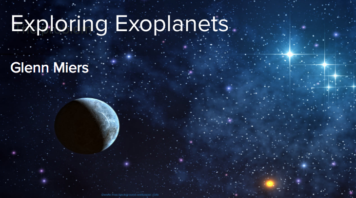
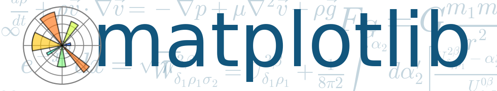

# Outline
1. [Unsupervised Learning](#1Unsupervised Learning)
2. [Exoplanets](#2Exoplanets)
3. [Data Challenges](#3Data Challenges)
4. [Methodology](#4Methodology)
    [4.1 Data Wrangling and Processing](#4_1 Data Wrangling and Processing)
    [4.2 Data Imputation](#4_2 Data Imputation)
    [4.3 Clustering](#4_3 Clustering)
    [4.4 Dimensionality Reduction](#4_4 Dimensionality Reduction)
    [4.5 Data Interpretation](#4_5 Data Interpretation)
5. [Major Results and Interpretation](#5 Major Results and Interpretation)
6. [Future work](#6Future work)
7. [Tools Used](#7Tools Used)

### 1. <a id="1Unsupervised Learning">Unsupervised Learning</a>
* Very powerful technique for exploratory data analysis (EDA)
* There are many applications for unsupervised learning
    * Marketing
    * Genetics
    * Politics
    * Many others
* Here, unsupervised learning has been used to detect interesting structure in exoplanet data available from the <a href="http://exoplanetarchive.ipac.caltech.edu/">NASA exoplanet archive,</a>

### 2. <a href="2Exoplanets">What are exoplanets</a>
* Exoplanets are planets that we have discovered outside of our solar system
* There is a LOT of data available on exoplanets, for instance:
  * http://exoplanetarchive.ipac.caltech.edu/index.html

### 3. <a href="3Data Challenges">Data Challenges</a>

### 4. <a name="4Methodology">Methodology</a>

### 5. <a name="5Major Results and Interpretation">Major Results and Interpretation</a>

### 6. <a name="6Future work">Future work</a>

### 7. <a name="7Tools Used">Tools Used</a>
* ScikitLearn KMeans clustering
* Numpy Singular Value decomposition (SVD)
* ScikitLearn Agglomerative clustering
* Matplotlib for plotting and interpretation of data
* Pandas and Numpy for quick and convenient data manipulation

###What can we quickly discover about exoplanets using out-of-the box tools in Python?
* What are some common characteristics of exoplanets?
* Where are they in relation to the Earth and Sun?
* How similar are they to the Earth and Sun?
* What are Habitable planets, and how do they compare to the Earth and Sun?

  
 
